An implementation by Chirașcu Mara and Bodean Catrina after Paul A. Gagniuc et al. *Spectral Forecast: A general purpose prediction model as an alternative to classical neural networks*. Chaos 30, 033119 (2020); doi: 10.1063/1.5120818 https://aip.scitation.org/doi/pdf/10.1063/1.5120818

### Table of contents ###
1. [Input data](####input-data)
2. [Algorithm](#algorithm)
3. [Output data](#output-data)

#### Input data ####
The raw input data is gathered from sensors placed on the subjects' skin; the data for each person is represented by a matrix titled A\_[patient number] for normal subjects, B\_[patient number] for diabetic subjects, and P\_[patient number] for subjects who are healthy, but have a certain predisposition to developing diabetes.

To exemplify this process, we randomly generate the necessary values, in the [generate\\_test\\_input.py](./input/generate_test_input.py) file, but we use the initial data in the cited paper as a guideline.

The data is then processed: we calculate the average of all data sets in a group and we create two matrices, [A.in](./input/A.in) and [B.in](./input/B.in). These will be the values we will use for calculating the forecast. We will not calculate an average for the P matrices, because we want to know the forecast for each patient.

#### Algorithm ####
For simplicity's sake, all data processing takes place in the SpectralForecast class.

Firstly, the program reads all the data input (```read_input_data```), and then creates the 2 average matrices (```create_matrices```).

Then, we use the equation below to calculate a prediction matrix M, through ```generate_M_states```.

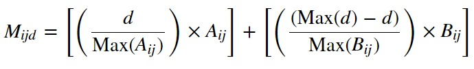

Afterwards, we calculate the similarity indexes for each P matrix, in the ```test_P_matrices``` function, with the following formula:

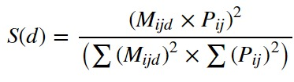

In the end, we print the matrix with all the similarity indexes and we trace a plot for each patient, where we mark the point with the highest similarity index (```print_results```). For readability, we will only display 10 plots, and we will illustrate the output data only for 2 patients.
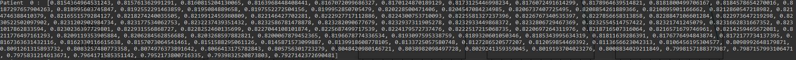
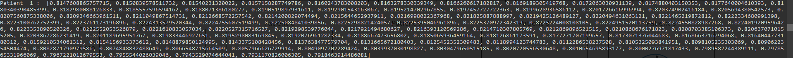
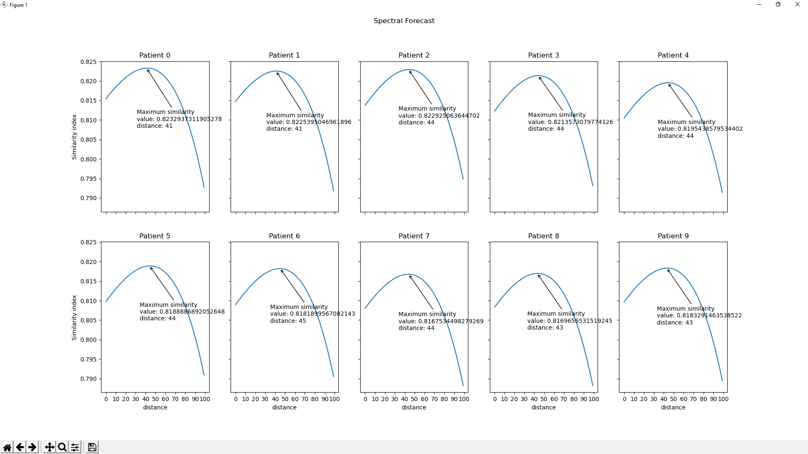

#### Output data ####
To illustrate how our algorithm works, we ran several tests with diferent data sets.

**Test 1**
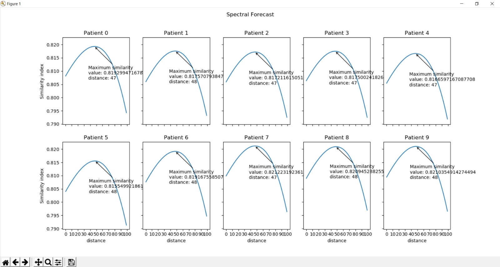

**Test 2**
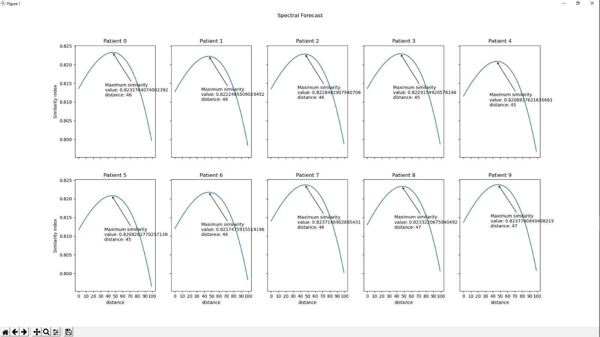

**Test 3**
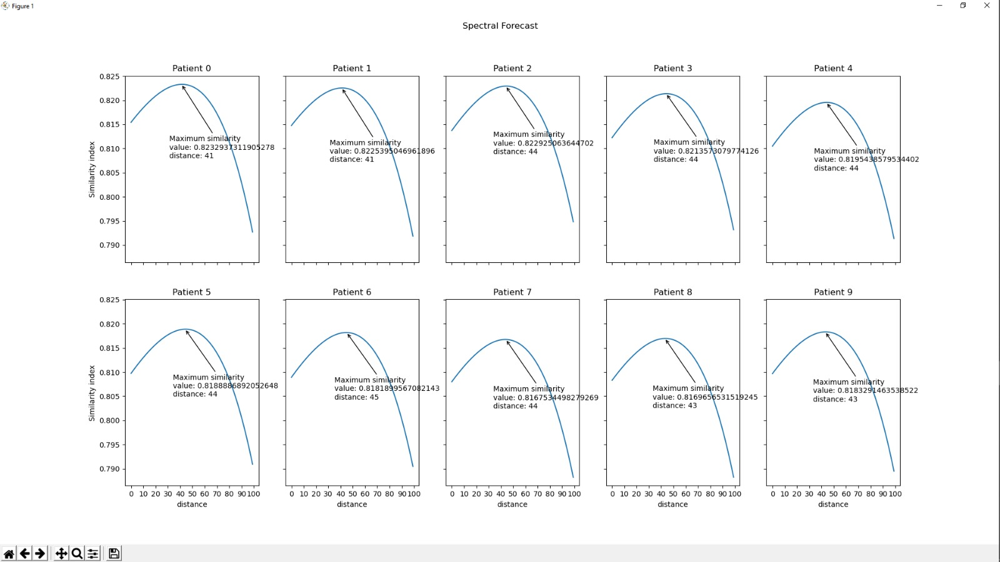

**Test 4**
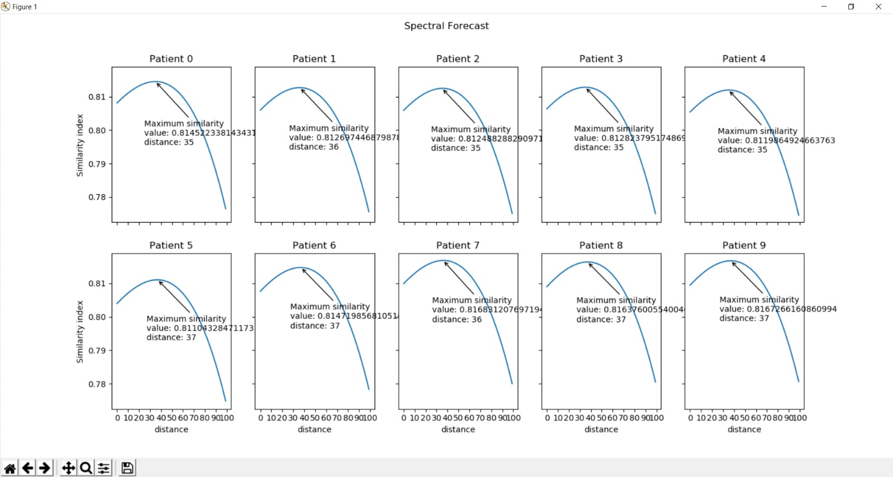

**Test 5**
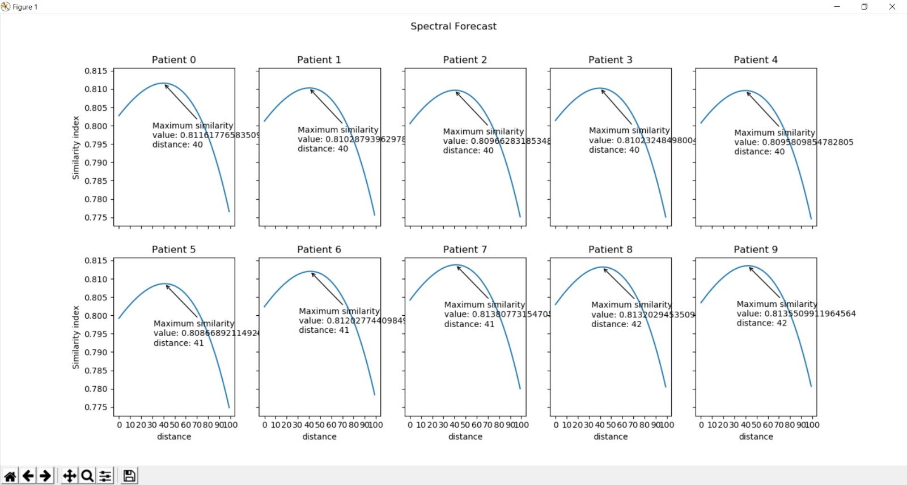

**Test 6**
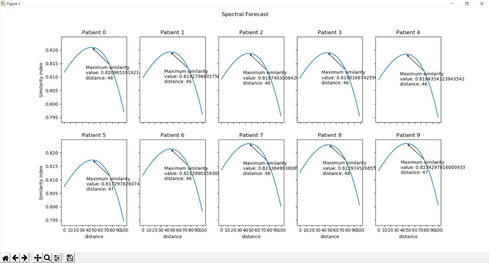

**Test 7**
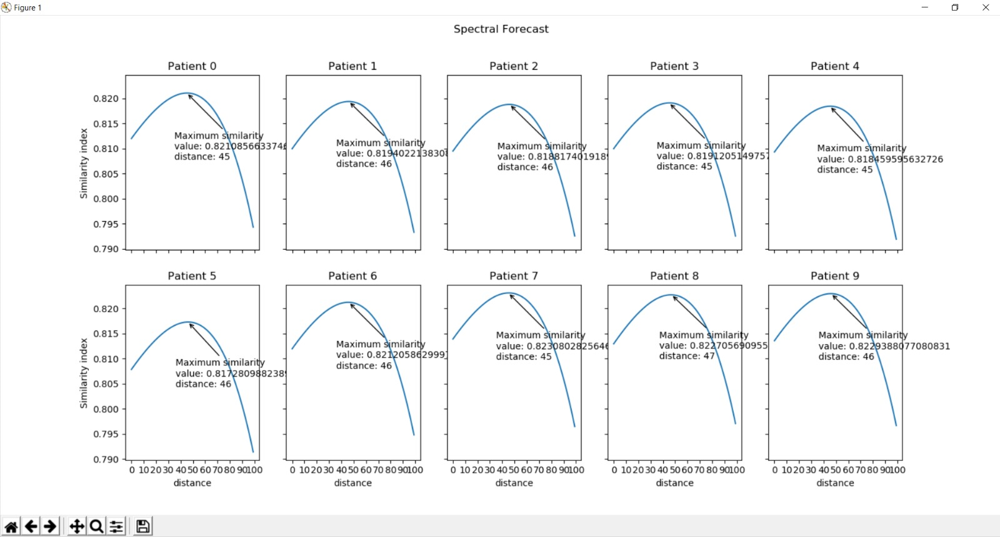

As we can see, because we are using data generated from the same file ([P.in](./input/P.in)), the highest similarity index for each patient is always around the same value in the test data set; this is also the reason why there isn't a big difference even between different tests.